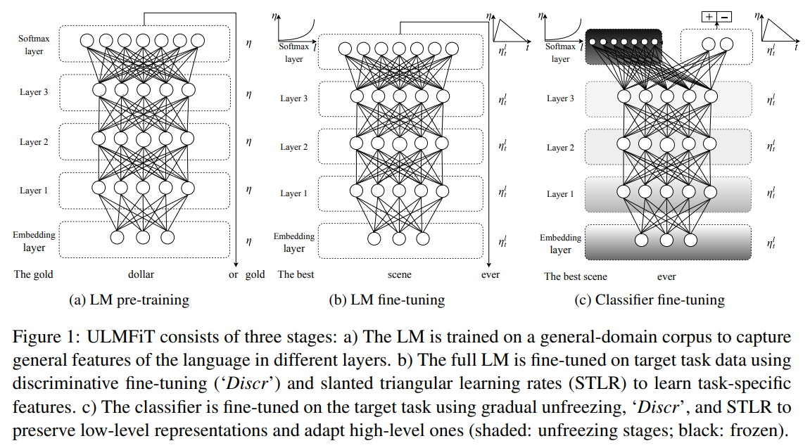
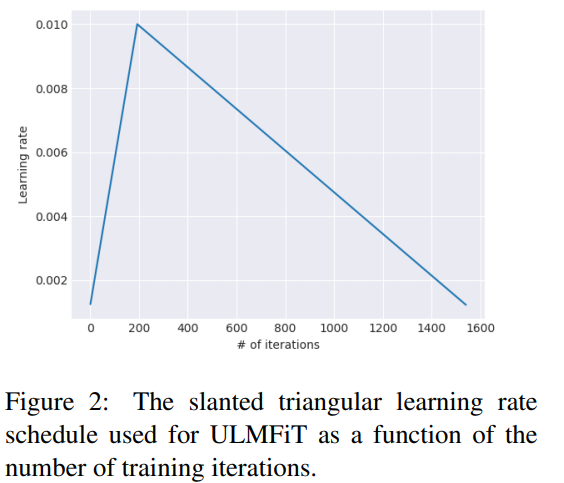

# FastAI

## Training tips

1. metrics does **not** affect training result. They exist merely for monitoring purposes
2. use `partial()` to modify existing functions in order to obtain desired parameters. For example: `acc_02 = partial(accuracy_thresh, thresh=0.2)`
3. Early stop call back is super useful: 

```python
learn = Learner(data, model, metrics=[acc_02], callback_fns=[EarlyStoppingCallback, monitor='accuracy', min_delta=0.01, patience=3])
```

4. `fit_one_cycle()` is essentially a learning_rate scheduler in that we specify our `max_lr` and the training starts with smaller `lr` bump-up to `max_lr` and decrease again in the end of the learning cycles. Therefore:

    `fit_one_cycle(5)` $\neq$`fit_one_cycle(3)`$ + $`fit_one_cycle(2)`

5. When run `learn.recorder.plot_losses()` a good training losses looks like an **increase** of training loss and then it **decreases**.
6. If GPU is deemed too “small” for the learning task, use **half precision** for training by constructing the learning to additional argument in the end(see documentation): `learn = Learner.create_unet(data, models.resnet34, metrics=metrics).to_fp16()` . This turn the program to run in 16-bit precision(so save GPU RAM).
7. 


## NLP models

FastAI adopts transfer learning in their NLP applications.


* Step 1: training the model on Wikitext to gain understanding of English language.<span style="color:red"> **Self-supervised learning**</span> (no label)

* Step 2: training the model on IMDB(our appplication) to gain understanding of the language used in this context (the model’s task is to predict “the next word”)<span style="color:red"> **Self-supervised learning**</span> (no label)

```python
data_lm = (TextFilesList.from_folder(path)
           # Inputs: all the text files in path
           .filter_by_folder(include=['train','test'])
           # We may have other temp folders that contain text files so we only keep what's in train and test
           .random_split_by_pct(0.1)
           # We randomly split and keep 10% for validation
           .label_for_lm()   # IMPORTANT
           # *We want to do a language model with SELF-SUPERVISED learning*
           .databunch()
)
```

```python
# create RNN language_model
Learn = language_model_learner(data_lm,pretrained_model=URLs.WT103, drop_mult=0.3) # this last parameter is to set dropout
```

<span style="color:red"> from here, fine tuning. check [link](https://github.com/fastai/fastai/blob/master/courses/dl1/lesson4-imdb.ipynb)</span>

Finally:

```python
learn.save_encoder('fine_tuned_enc')
```


* Step 3: transfer learning applied to the model above to train it to be a **classifier**(our task)

```python
data_clas = (TextFilesList.from_folder(path, vocab=data_lm.vocab)
             # make sure that we use the same vocab as our lm_enc
             .split_by_folder(valid="test")
             # split by train adn valid folder
             .label_from_folder(classes=['neg','pos'])
             # label them all with their folders
             .databunch(bs=50)
)
data_clas.save('tmp_clas')
# Here we save the language model data after it's pre-processed
```

```python
data_clas = TextClassDataBunch.load(path, 'tmp_clas', bs=50)
# This allow us to retrieve pre-processed data, so we don't need to process again
learn = text_classifier_learner(data_clas, drop_mult=0.5)
learn.load_encoder('fine_tuned_enc')
# Loading the pre-trained encoder from the 'train+test' dataset
learn.freeze()
```

* Step 4: During training, we do something a little differently after trained frozen model: 

  ```python
  learn.fit_one_cycle(some_num,2e-2, moms=(0.8, 0.7))
  ```

  Here, instead of unfreeze all, we use `learn.freeze_to(-2)` to unfreeze() only the last 2 layers:

  ```python
  learn.freeze_to(-2)
  learn.fit_one_cycle(some_num, slice(1e-3, 1e-2), moms=(0.8,0.7))
  learn.freeze_to(-3)
  learn.fit_one_cycle(some_num, slice(1e-4, 1e-3), moms=(0.8,0.7))
  ```

  It was found in training language models very helpful to <span style="color:red"> unfreeze one layer at a time</span>.

  Further more, when training RNNs, we should decrease <span style="color:red"> momentum</span> a little bit.

* A note on Learning_rate:  

```python
slice(1e-3/2.6**4, 1e-3)
```

2.6 is a good decreasing ratio for RNNs. This means there are 5 layers, each layer’s learning_rate is $/2.6$ of the last. This is called: **discrimative learning rate**.

```python
fit(1, 1e-3)				# 1e-3 for final layers
fit(1, slice(1e-3))			# 1e-3 for finals and 1e-3/3 for the rest
fit(1, slice(2e-5, 1e-3))	# 1e-3 for final layers, 1e-5 for first layer and mutiplicatively even distributed fo
```


# Collaborative Filtering

collaborative filtering is where you have information about your user(who bought what, who likes what).

The simplest version of a collaborative filtering have just two columns: user ID and product ID. In addition to that, we can add additional information (like no. of stars/time code). 

 

# Understand weight decay


In traditional statistics, it’s said we overfit because we have **too many parameters**. The reality, we just don’t want the function to be too complex(remove parameters that are really small instead of just **limiting the number of parameters**).

In other words, **complexity** is not just how many parameters we have but the number of excessive parameter.

We want more parameters because we need as much non-linearity as necessary to be able to fit the data well, yet no more than necessary. So we penalise **complexity**. (<span style="color:red">suming of the squre of all the parameters, a.k.a, **L2**</span>) and this number is going to be multiplied by a **weight decay** to properly scale the **L2 loss**. 

**Note:** weight decay of 0.1 usually works really well. The default `wd` in all FastAI `Learner`s are 0.01 to be conservative. However, in most cases, having a weight decay of **0.1** usually helps to prevent over-fitting.

# Some thoughts on Optimisation methods

1. SGD: Very **slow convergence rate**. Yet, used correctly, should perform very competitive results.

2. SGD+Momentum: **10%** of the update is the derivative and **90%** is the direction that we moved last time.

   In practice, this converges much faster than vanilla SGD. It moves faster if our gradient keeps pointing to the same direction.(so momentum builds up)

   $S_t=\alpha g+(1-\alpha)S_{t-1}$    where, $g$ is the *gradient*

   Usually $\alpha=0.1$ so that we take 90% of the direction of the previous update

   When update:

   $weight_t = weight_{t-1} - lr*S_t$

   

3. RMSProp: 

   $RMSProp_t = \alpha g^2+(1-\alpha)RMSProp_{t-1}$

   When update:

   $weight_t = weight_{t-1} - \frac{lr*g}{\sqrt{RMSProp_t}}$

   This means that is the *gradient* is small and consistently very small, $g^2$ term will be a very **small** number. So we move **faster**.

   If the *gradient* is volatile(moving positive and negative all of the time). The $g^2$ term is **big**. So we move slower.

   

4. Adam: Do **both** momentum and RMSProp

   $S_t=\alpha g+(1-\alpha)S_{t-1}$

   $RMSProp_t = \alpha g^2+(1-\alpha)RMSProp_{t-1}$

   

    $S_t=0.1 g+0.9*S_{t-1}$

   $RMSProp_t = 0.1g^2+0.9*RMSProp_{t-1}$

   

   When update:

   $weight_t = weight_{t-1} - \frac{lr*\color{red}{\textbf{S_t}}}{\sqrt{RMSProp_t}}$


# Dropout in FastAI

Parameter `ps=` specifies dropout rates for each layer, this parameter receives a list[] of `p`s. Alternatively, we can assign `ps=` with one value, so that we have the same dropout rate everywhere.

### Embedding dropout

`emb_drop=` specifies the dropout rate for **embedding layer**. 

This happens in `tabular_learner` where we have *categorical input* and they will be passed through embedding layers by default. FastAI figures out the number of categories and will **assign a default embedding dimension** for the feature.

This helps the **regularisation** for the categorical features in tabular data.

what about continuous features?

### Batch-norm

`bn-cont()` takes care of the **regularisation** of the **continuous variables** by doing batch-normalisation.

Batch-norm accelerates *deep network training* , so that it **converges** faster and training loss become more smooth instead of oscillating. PS: because of this, we could *increase our learning rate*.

# FastAI Callback a deep look

Callbacks are just a fancy name for functions that are triggers in various stages of the training loop. There are many different thing we might want to do, e.g.:

* Print out some custom metrics during the tranining
* Alter the **learning rate** throughout the training
* Switch our training between different models (this is often used in GANs)

Essentially, callbacks allow us to insert custom code into the training loop at different times.

#### Recall a basic training loop

```python
def one_batch(xb,yb):
    pred = model(xb)
    loss = loss_func(pred, yb)
    loss.backward()
    opt.step()
    opt.zero_grad()
    
def fit():
    for epoch in range(epochs):
        for b in train_dl: one_batch(*b)
```


## To create callbacks

1. Create some **callback objects**
2. Create a **CallbackHandler**. This is a object where we store our **callback objects**
3. Incorporate the **callbacks** into our training loop

### Step 1

Here are some examples of simple **callback objects**:

```python
class BatchCounter(Callback):
    def begin_epoch(self, epoch):
        self.epoch=epoch
        self.batch_counter = 1
        return True
    def after_step(self):
        self.batch_counter +=1
        if self.batch_counter % 200 == 0:
            print(f'Batch {self.batch_count} complete')
        return True
        
class TimeCheck(Callback):
    def begin_fit(self, learn):
        self.learn = learn
        self.epoch_counter = 1
    def begin_epoch(self, epoch):
        self.epoch = epoch
        print(f'Epoch {self.epoch_counter} started at {time.strftime("%H:%M:%S", time.gmtime())}')
        self.epoch_counter += 1
        return True
    
class PrintLoss(Callback):
    def after_epoch(self):
        print(f'Loss: {self.loss}')
        return True
```


### Step 2

Now that we have a bunch of **callback objects** created, we need to create a new class named **CallbackHandler** :

```python
class CallbackHandler():
    def __init__(self, cbs=None):
        self.cbs = cbs if cbs else []
    def begin_fit(self, learn):
        self.learn, self.in_train = learn, True
        learn.stop = False
        res = True
        for cb in self.cbs:
            res = res and cb.begin_fit(learn)
        return res
    
    def after_fit(self):
        res = not self.in_train
        for cb in self.cbs:
            res = res and cb.after_fit()
        return res
    
    def begin_epoch(self, epoch):
        learn.model_train()
        self.in_train = True
        res = True
        for cb in self.cbs:
            res = res and cb.begin_epoch(epoch)
        return res
    
    def begin_validate(self):
        self.learn.model.eval()
        res = True
        for cb in self.cbs: 
            res = res and cb.begin_validate()
        return res
```

**CallbackHandler** allow us to do two things:

1. A place to store all of our individual callbacks in a list named `self.cbs`. (This happens in the “`__init_`” function)
2. It allows us to easily call of our individual callbacks at the same time for *each different point in the training loop*. This is why we create a functions(*begin_fit, after_fig, begin_epoch*, etc). When we call one of these funtions, it goes through all our individual callbacks (*BatchCounter, TimeCheck, PrintLoss*) and calls its same-named function.

Here is a diagram summary:


### Step 3: Incorporate the callbacks into our training loop

Now, edit the *original training loop* so that it uses these callbacks.

We pass our **CallbackHandler** to the training loop as an *input*, and then we add some new lines into the training loop that call each of the function in the **CallbackHandler**.

For comparison purposes, here is the vanilla training loop:

```python
def one_batch(xb,yb):
    pred = model(xb)
    loss = loss_func(pred, yb)
    loss.backward()
    opt.step()
    opt.zero_grad()
    
def fit():
    for epoch in range(epochs):
        for b in train_dl: one_batch(*b)
```

Now, with **Callbacks**:

```python
def one_batch(xb, yb, cb):
    if not cb.begin_batch(xb, yb): return
    loss = cb.learn.loss_func(cb.learn.model(bx), yb)
    if not cb.after_loss(loss): return
    loss.backwards()
    if cb.after_backward(): cv.learn.opt.step()
    if cb.after_step(): cblearn.opt.zero_grad()
# Notice that many of the training functions are not incorported in to the callback functions.
# So our have sort of a time-stamp to triger customized Callback functions at these time-stamps

def all_batches(dl, cb):
    for xb, yb in dl:
        one_batch(xb, yb, cb)
        if cb.do_stop(): return
        
def fit(epochs, learn, cb):
    if not cb.begin_fit(learn): return
    for epoch in range(epochs):
        if not cb.begin_epoch(epoch): continue
        all_batches(learn.data.train_dl, cb)
        
        if cb.begin_validate():
            with torch.no_grad(): all_batch(learn.data.valid_dl, cb)
        if cb.do_stop() or not cb.after_epoch(): break
    cb.after_fit()
```

Notice that there are a lot of `if` statements in the updated code. This gives us the ability to stop the training at any time we want (or just skip specific steps). For example, if we only wanted to train for 20 batches, we could create a callback that returns `False` after 20th batch is complete.

### Appendix

1. Why do we need a generic callback class?

   All the callbacks that we created inherited from a generic `callback` class. This is to make sure that every callback object has **a function defined for every different point in time** (begin_fit, after_fit, begin_epoch, etc.) If these functions aren’t all degined, then we will get an exception when the training loop runs, because it looks for each of these functions.

   The following is the generic callback class:

   ```python
   class Callback():
       def begin_fit(self, learn):
           self.learn = learn
           return True
       def after_fit(self): return True
       def begin_epoch(self, epoch):
           self.epoch = epoch
           return True
       def begin_calidate(self): return True
       def after_epoch(self): return True
       def begi_betch(self, xb, yb):
           self.xb, self.yb = xb, yb
           return True
       def after_loss(self, loss):
           self.loss = loss
           return True
       def after_backward(self): return True
       def after_step(self): return True
   ```

# DenseNet

### First we have the famous <span style="color:blue">Resnet</span>

Below is the standard ResBlock:


In this block input is added to the output so that gradient flows more efficiently.

### In a DenseNet

We have the **Identity X** *concatenated* to the output instead of added to.

A standard **ConvNet** looks like this:


And this is the <span style="color:blue">**Resnet**</span> (*element-wise addition*):


Finally, we have our <span style="color:red">**DenseNet**</span> (Concatenation):


The idea is that: **Since each layer receives feature maps (collective knowledge) from all preceding layers, network can be thinner and compact.**

As we can see from the picture, no matter how deep our network gets, the **input layer** feature map is still preserved as it is.

The problem is that, because we preserve all these features, **DenseNet** is very memory intensive. So that They works really well for **Smaller dataset** as well as **Segmentation**.

## Initialization

A note on initialization: we would want to initialize our weights in a way that their initial value after activation have the property of **Mean close to 0, and STD close to 1**.

Good sources of information: check out this [paper](https://arxiv.org/pdf/1502.01852.pdf) from Kaiming He and this [blog post](https://pouannes.github.io/blog/initialization/).

#### Why is initialization essential?

Put it simply, if you do it wrong, it could potentially lead to exploding or vanishing weights and gradients. That means that either the weights of the model explode to infinity or they vanish to 0. This hampers the training process. The **Xavier** and **Kaiming** method follow a very similar reasoning that differs a tiny bit at the end. The only difference is that the Kaiming paper takes into account the activation function(**ReLU**) which **Xavier** does not.

#### Kaiming Initialization

Rectifier networks are easier to train compared with traditional *sigmoid-like* activation networks. But a bad initialization can still hamper the learning of a highly non-linear system. Let’s see how robust initialization method that removes an obstacle of training extremely deep rectifier networks.

Recent deep CNNs are mostly initialized by random weights drawn from ***Gaussian distributions***. With fixed standard deviations (e.g. 0.01), very deep models have difficulties to converge and leads to poorer local optimum. *Glorot and Bengio* proposed to adopt a properly scaled uniform distribution for initialization. This is called “*Xavier*” initialization. Its derivation is based on the assumption that the activations are linear. This assumptions is invalid for **ReLU**.

Therefore, He et. al. derived a theoretically more sound initialization by taking **ReLU** into account. This method greatly improved our ability to train our models towards convergence.

The central idea is to investigate the variance of the responses in each layer, for a **Conv layer**, a response is:

​												$$y_l = W_lX_l+b_l$$		

Here, x is a $k^2c$-by-1 vector that represents co-located $k\times k$ pixels in $c$ input channels.$k$ is the spatial filter size of the layer. With $n=k^2c$ denoting the number of connections of a response, $W$ is a $d$-by-$n$ matrix, where $d$ is the number of filters and each row of $W$ represents the weights of a filter.**$b$** is vector of biases, and $y$ is the response at a pixel of the output map. We use $l$ to index a layer and have $x_l = f(y_{l-1})$ where $f$ is the activation. Finally, $c_l=d_{l-1}$.

**A note there**: a **Conv** layer can also viewed just as a **Dense** layer activation is this fashion.

We let the initialized elements in $W_l$ be mutually independent and share the same distribution. Assuming that the elements in $x_l$ are also mutually independent and share the same distribution, and $x_l$ and $W_l$ are independent of each other. Then we have:
$$
\begin{align*}
	Var[y_l] = n_lVar[w_lx_l]
\end{align*}
$$
where now $y_l$,$x_l$, and $w_l$ represent the random variables of each element in $y_l$, $W_l$, and $x_l$ respectively. We let $w_l$ have zero mean. Then the variance of the product of independent variables gives us: 
$$

\begin{align*}
    Var[y_l] = n_lVar[w_l]E[{x_l}^2]
\end{align*}
$$
Here $E[{x_l}^2]$ is the expectation of the square of $x_l$. 

With $L$ layers put together, we have:
$$
\begin{align*}
    Var[y_L] = Var[y_l](\prod_{l=2}^L\frac{1}{2}n_lVar[w_l])
\end{align*}
$$
This leads to a zero-mean **Gaussian distribution** whose standard deviation is $\sqrt{2/n_l}$. This is *Kaiming He*‘s way of initialization. They also initialize $b=0$.

In **PyTorch** it’s implemented as:

```python
def reset_parameters(self):
    n = self.in_channels
    init.kaiming_uniform_(self.weight, a=math.sqrt(5))
    if self.bias is not None:
        fan_in, _ = init._calculate_fan_in_and_fan_out(self.weight)
        bound = 1 / math.sqrt(fan_in)
        init.uniform_(self.bias, -bound, bound)
```

 `fan_in = num_inputs*receptive_fieldsize`  

 `fan_out = number_filters*receptive_fieldsize`

receptive_fieldsize = num_pixel*num_pixel which is the field size of this particular filter.

E.g , for a layer with weight matrix of `torch.Size([32,1,5,5])`

num_input = 1

num_filters = 32

rec_fieldsize = 5*5 = 25

`fan_in = 1*25 = 25`

`fan_out = 32*25 = 800`

## How FastAI `freeze()` and`unfreeze()` work

This is a short note. `Freeze()` and `Unfreeze()`   are used when we are training a model with transfer learning (which is almost always).

What Jeremy found was that if we naively train our model by “*freezing the body train the head, and unfreeze*” strategy, the result is bad because of all the `Batchnorm` layers in between. The `Batchnorm` layers are trained initially with the *mean* and *variance* of the **source task** and will not generalize well on **target task** if we don't train them properly. So the solution is to train both the *`head`* and the `Batchnorm` layers then we `freeze()`.

# Another look at FastAI NLP model: ULMFiT (with its original paper)

ULMFiT is **transfer learning** applied to AWD-LSTM. The following is an example of training an <span style="color:red">**IMDb**</span> classifier while utilize wikitext data.

1. Preprocess <span style="color:green">wikitext 103</span> and <span style="color:red">**IMDb**</span>
2. Train <span style="color:green">wikitext 103</span> on AWD-LSTM Language Model(LM)
3. Fine-tune <span style="color:green">wikitext 103</span> using <span style="color:red">**IMDb**</span>
4. Preprocess <span style="color:red">**IMDb**</span> for classification
5. Fine-tune <span style="color:red">**IMDb**</span> Language model for classification



PS: LM in this context is a general term that mean: **predicting the next element in a sequence**.

Main contributions of ULMFiT paper:

1. Universal Language Model Fine-tuning(ULMFiT) can be used to achieve CV-like transfer learning for any task for NLP.
2. **discriminative fine-tuning**
3. **slanted triangular learning rates**
4. **gradual unfreezing**
5. Point 2-5 are novel techniques to retain previous knowledge and avoid catastrophic forgetting during fine-tunning
6. They show that ULMFiT enables extremely sample-efficient transfer learnining and perform an extensive ablation analysis

### Discriminative Fine-tuning

Instead of using the same learning rate for *all layers* of the model, discriminative fine-tuning allows us to tune *each layer* with different learning rates.

Therefore the learning rate $\eta$ will a function of the layer number $l$. We have layers $1-L$ , their corresponding parameters $\{\theta^1,...,\theta^L\}$  and corresponding learning rates $\{\eta^1,...,\eta^L\}$.

### Slanted triangular learning rates (STLR)

For adapting its parameters to task-specific features, we would like the model to quickly converge to a suitable region of the parameter space in the beginning of training and then refine its parameters. Using the same learning rate for an annealed learning rate throughout training is not the best way to achieve this behavior.

**STLR** no long anneal learning rate with a “cosine-like” slope, rather a linear one. This method has a short increase and a long decay period which boosts the performance.



### Gradual unfreezing during fine-tuning

Fine-tuning the target classifier is the most critical part of the *transfer learning method*. Overly aggressive fine-tuning will cause catastrophic forgetting, eliminating the benefit of the information captured through language modeling; too cautious fine-tuning will lead to slow convergence (and resultant overfiting). Besides discriminative fine-tuning and triangular learning rates, **gradual unfreezing** is proposed.

We first unfreeze the **last layer** and fine-tune all un-frozen layers for one epoch.

Then unfreeze the **next lower frozen layer** and repeat.

Until all unfrozen layers converges.

### The AWD-LSTM model

```python
SequentialRNN(
  (0): MultiBatchEncoder(
    (module): AWD_LSTM(
      (encoder): Embedding(60003, 300, padding_idx=1)
      (encoder_dp): EmbeddingDropout(
        (emb): Embedding(60003, 300, padding_idx=1)
      )
      (rnns): ModuleList(
        (0): WeightDropout(
          (module): LSTM(300, 1150, batch_first=True)
        )
        (1): WeightDropout(
          (module): LSTM(1150, 1150, batch_first=True)
        )
        (2): WeightDropout(
          (module): LSTM(1150, 300, batch_first=True)
        )
      )
      (input_dp): RNNDropout()
      (hidden_dps): ModuleList(
        (0): RNNDropout()
        (1): RNNDropout()
        (2): RNNDropout()
      )
    )
  )
  (1): PoolingLinearClassifier(
    (layers): Sequential(
      (0): BatchNorm1d(900, eps=1e-05, momentum=0.1, affine=True, track_running_stats=True)
      (1): Dropout(p=0.4)
      (2): Linear(in_features=900, out_features=50, bias=True)
      (3): ReLU(inplace)
      (4): BatchNorm1d(50, eps=1e-05, momentum=0.1, affine=True, track_running_stats=True)
      (5): Dropout(p=0.1)
      (6): Linear(in_features=50, out_features=2, bias=True)
    )
  )
)
```

### RNN dropout

AWD-LSTM paper emphasizes that until contribution applying naive-classical fropout techniques on a LSTM for language modeling tasks were ineffective as it disrupts the ability to retain long term dependencies or the effective dropout methods that might work would require inefficient re-implementation of CUDN LSTM.

Retaining long term dependencies is a very key point, after all the main differentiator fo an LSTM over an RNN in practice is the capability of carrying out longer twem dependencies by learning how much information to flow through the sequence.

#### A close look can the naive dropout layer as compared to RNN dropout

What we actually want to achieve is to zero elements in a way that  same parts of hidden units are disabled throughout the sequence. After all at each forward pass by applying fropout we introduce a partially masked form of our model–$f(x)$, and **masked weights should be consistent for each and every input’s forward pass.**

```python
# shape : (1, 3, 5) - (bs, seq_len, emb_len)

# taking a single sentence like "I love dogs" as an example
# case 1: naive dropout 
tensor([[ 1.7339,  0.2212, -2.5182, -0.0000,  2.2808],
        [-0.6162,  0.4100, -0.6159, -1.3283,  1.8158],
        [-2.5599, -1.5934, -2.1049,  0.8675, -0.6511]])

# case 2: special RNN dropout
tensor([[ 1.7339,  0.0000, -0.0000, -1.7596,  2.2808],
        [-0.6162,  0.0000, -0.0000, -1.3283,  1.8158],
        [-2.5599, -0.0000, -0.0000,  0.8675, -0.6511]])
```

As we can see, the RNN drop will disable the **same weights of RNN layer** which ensures that *hidden unit* is turned off for this entire batch. As the result, on update of this batch will not depend on the hidden unit 2 and hidden unit 3 entirely. Thus hidden unit 1, 4, 5 will have to learn significant features to make reasonable output.


## Pre-processing in FastAI

In traditional NLP pre-processing step: removing stop words, stemming, lemmatization are very standard and useful process. However, in deep learning we tend not to remove information from our corpus that are potentially useful.

Hence, in FastAI preprocessing is conducted in a much different style which you can find in my [GitHub example]().